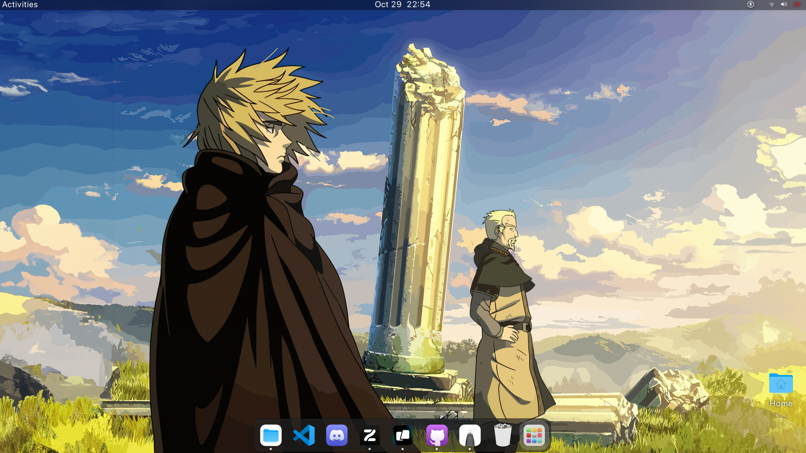

# Snip's Workstation Configuration  for Ubuntu

## Overview

This script automates the setup of a fresh Ubuntu installation, providing a convenient way to install essential software and customize system settings. It streamlines the configuration process which helps me to quickly get my development environment up and running.



## What This Script Does

- Installs essential system programs and updates the system.
- Configures the desktop environment with themes, icons, and wallpapers.
- Installs a variety of applications tailored for development, media consumption, and productivity.
- Configures Git with user-defined settings.
- Sets up development tools and runtimes.

## Automatic Setup

The script performs the following actions automatically:

1. **System Updates**: Updates the package list and upgrades installed packages.
2. **GNOME Tweaks and Extensions**: Installs GNOME Tweaks and the GNOME Shell Extension Manager for desktop customization.
3. **Theming**: Sets up GTK themes, icons, and wallpapers.
4. **Application Installation**: Installs various applications through Flatpak and Snap.
5. **Development Tools**: Installs build tools, runtimes, and configures Git.
6. **Prompt for Additional Installations**: Asks the user whether to install specific applications and tools.

## Applications Installed

The script installs the following applications automatically:

- **Browsers & Media Players**:
  - Zen Browser
  - Warehouse (Flatpak tool)
  - Amberol (Audio Player)
  - Fotema (Photo Gallery)
  - Clapper (Video Player)
  
- **Development Tools**:
  - Visual Studio Code (Snap)
  - ArmCord - Discord Client
  - OBS Studio (optional)
  - Blender (optional)
  - MongoDB Compass (optional)
  - Warp Terminal (optional)

## System Requirements

This script is intended for **Ubuntu** and has been tested on **Ubuntu 22.10**. 

### Execution Directory

Before running the script, make sure to navigate to the following directory:

```bash
cd ~/Downloads/workstation-config
```

## Manual Configuration After Installation

After the installation completes, you will need to manually:

- Install GNOME extensions. Apply GNOME shell theme. 
- Configure display scaling and mouse sensitivity to your liking.
- Set up the GRUB boot order if needed.

## Using this script for yourself

This script significantly simplifies the initial setup of an Ubuntu workstation, making it ideal for developers and general users looking to streamline their environment configuration but several steps are suited for my personal preference and comfort. For any issues or further customization, feel free to modify the script as needed.

## Wallpapers


## TODO:
- [ ] Avoid offline installation of applications 
- [ ] Automate the installation of GNOME extensions if possible
- [ ] Add Github Desktop to application
